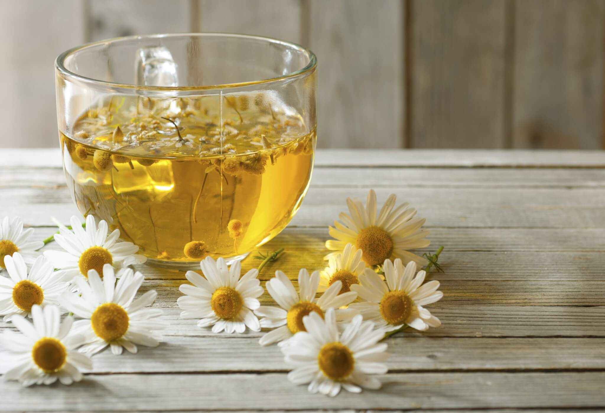
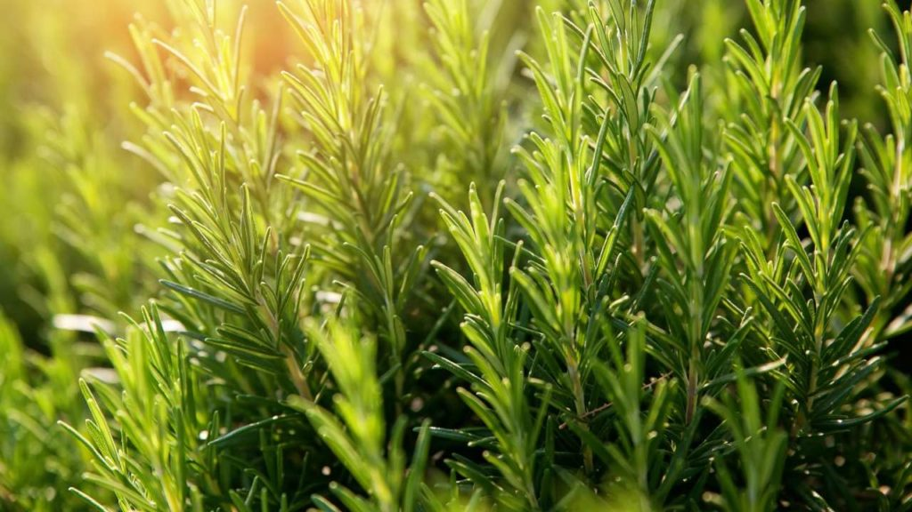

# 🌿 Ervas Medicinais – Feira de Ciências

Este projeto apresenta um **cartaz digital interativo** sobre **10 ervas medicinais**, explorando seus **princípios ativos**, **mecanismos de ação** e **efeitos no corpo humano**, com foco na química envolvida após a ingestão.  

---

## 👥 Grupo

- **Edson** – Pesquisas químicas e roteiro  
- **Cristina** – Coleta das ervas  
- **Carla** – Visual e personalização  
- **Profª Rayanne** – Orientação

---

## 🌱 Descrição do Projeto

O cartaz destaca 10 ervas populares com informações detalhadas:

- Princípio ativo de cada erva  
- Como o corpo reage quimicamente à ingestão  
- Efeitos e cuidados necessários  
- Visual organizado com **imagens acima do texto**, para melhor legibilidade

> O objetivo é mostrar a relação entre **química e medicina natural**, tornando o conteúdo **claro e educativo**.

---

## 🖥 Tecnologias Utilizadas

- **HTML5** – Estrutura da página  
- **CSS3** – Layout responsivo, gradientes e efeitos visuais  
- **GitHub Pages** – Hospedagem online

---

## 📁 Estrutura do Projeto

projeto-ervas/
│
├─ index.html # Página principal do cartaz
├─ assets/ # Pasta com imagens das ervas
│ ├─ camomila.jpg
│ ├─ hortela.jpg
│ ├─ alecrim.jpg
│ └─ ... (demais imagens)
└─ README.md # Este arquivo


---

## 🌿 Ervas Incluídas

| Erva | Imagem | Efeito |
|------|--------|--------|
| Camomila |  | Calmante, auxilia no sono |
| Hortelã |  | Melhora digestão, sensação refrescante |
| Alecrim |  | Apoio à memória, circulação |
| Erva-doce |  | Alívio de gases e cólicas |
| Boldo |  | Auxilia digestão de gorduras |
| Gengibre |  | Reduz náuseas, anti-inflamatório leve |
| Capim-limão |  | Calmante, relaxamento muscular |
| Alho |  | Apoio imunológico e cardiovascular |
| Eucalipto |  | Descongestionante respiratório |
| Lavanda |  | Relaxante, auxilia no sono |

> As imagens estão dimensionadas para caber perfeitamente nas caixas usando `object-fit: cover`.

---

## 🔗 Como Visualizar

1. Clone o repositório:

```bash
git clone https://github.com/seu-usuario/nome-do-repositorio.git
